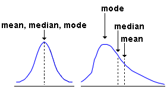
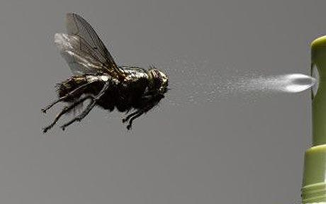

```{r setup, include=FALSE}
knitr::opts_chunk$set(echo = TRUE,
                      cache = FALSE)
```


## Introduction to statistics with R
One of the really cool things about R, as opposed to other languages like python, matlab etc. is that it has such a wide user base in the statistics community and many packages that have been developed to analyze data with old and new statistical techniques and modelling. Most of these (but not all) are available on CRAN. Although we won't cover much beyond the basics today (which could just as easily be done in most other languages), more advanced things like bayesian techniques


### Preliminary Step: load example data


Read in (again) the gambling dataset:
```{r}
gambling.data <- read.csv(file = "http://data.justice.qld.gov.au/JSD/OLGR/20170817_OLGR_LGA-EGM-data.csv",
                 header = TRUE,
                 sep = ",",
                 stringsAsFactors = FALSE)

# rename columns
names(gambling.data)[2] <- "Local.Govt.Area"
names(gambling.data)[7] <- "Player.Money.Lost"
names(gambling.data)[1] <- "Month.Year"

gambling.data <- na.omit(gambling.data)

#Add a day of month (1st) to each date string
date.string <- paste0( "1 " , gambling.data$Month.Year )

 #Convert to POSIXlt, a date-time format
strptime( date.string , format = "%d %B %Y" ) -> gambling.data$Date

 # subset to Brisbane only
brisbane.only <- gambling.data[gambling.data$Local.Govt.Area=="BRISBANE",]

# Choose only the brisbane data from 2010
#row.indicies <- (brisbane.only$Date>="2010-01-01 AEST" &
#                 brisbane.only$Date<="2010-12-31 AEST")
#brisbane.2010.data <- brisbane.only[row.indicies,]
```

### Descriptive Statistics




All the standard summary statistics are available in R including:

- mean 
- sd 
- var
- min
- max
- median
- range
- quantile


```{r}
x <- c(1,3,5,2,9,NA,7,10,15,4,7,7)
x
mean(x)
```
If there are missing values, we can ignore them by setting `na.rm=TRUE`:
```{r}
mean(x, na.rm=TRUE)
```

```{r}
median(x,na.rm = T)
var(x, na.rm = T)     # variance
sd(x, na.rm = T)      # standard deviation
```
In R, you can use the function `quantile()` to get median and quartiles, or you can
also use the function `summary()`, to get the quantiles as well as the mean, and the number of NA values:
```{r}
quantile(x, na.rm = T)

# mean,median,25th and 75th quartiles,min,max
summary(x)
```

### Visual Summaries: Box plots and Histograms

You get most of the same summary statistics visually from a boxplot: (in base R graphics)
```{r}
boxplot(x, horizontal = TRUE)
```


Or alternatively in ggplot:

```{r}
library(ggplot2)

some.LGAs<-sample(gambling.data$Local.Govt.Area,5)

subset.data<-gambling.data[gambling.data$Local.Govt.Area %in% some.LGAs,]

ggplot(data=subset.data,
       aes(x=Local.Govt.Area,y=Approved.EGMs))+
  geom_boxplot()+
  scale_y_log10()+
  coord_flip()+
  theme_minimal()

```


We can also look at the histogram of the counts of the data. To obtain a histogram, the scale of the variable is divided into consecutive intervals and the number of observations in each interval
is counted.

```{r}
hist(x)
```


Or plot a histogram in ggplot:


```{r,warning=F,message=F}
ggplot(data=subset.data,
       aes(x=Approved.EGMs,fill=Local.Govt.Area))+
  geom_histogram()+
  scale_x_log10()+
  theme_minimal()
```

### Correlation

```{r}
x1=sin(1:100/3)
y1=sin(1:100/3)
plot(x1,y1)

cor(x1,y1)


x2=rnorm(100)
y2=rnorm(100)
plot(x2,y2)

cor(x2,y2)
```

Calculating correlations for many variables at once


```{r}
#install.packages("corrplot")
library(corrplot)

MoneyDateLGA<-gambling.data[,c("Player.Money.Lost","Date","Local.Govt.Area")]

spreaddata<-tidyr::spread(MoneyDateLGA,3,1)

#remove the columns with NA values
spreaddata$TORRES<-NULL
spreaddata$LONGREACH<-NULL
spreaddata$BALONNE<-NULL

#plot corrplot
corrplot(cor(spreaddata[,-1]),
         order="hclust",
         tl.cex = .5, 
         tl.col = "black")
```


### Pair plots

```{r}
#install.packages("GGally")
library(GGally)

ggpairs(gambling.data[,-c(1,2)])
```


There are other functions and packages to obtain summary statistics of the datasets:

- `stat.desc()` in the pastecs package
- `describe()` in the Hmisc package
- `describe()` in the psych package...

## Simple Linear Regression

Simple linear regression is useful for examining or modelling the relationship between two variables.

```{r}
ggplot(data=gambling.data,
       aes(x=Operational.EGMs,
           y=Player.Money.Lost,
           color=Local.Govt.Area,
           group=1))+
  guides(color=FALSE)+
  geom_point()+
  geom_smooth(method = "lm",se=TRUE)
```


Fit a linear regression and look at a summary of its results. The model is of the form $y= mx+c$ where $y=$`Player.Money.Lost` and $x=$`Operational.EGMs`

```{r}
dollars_per_machine_model <- lm(Player.Money.Lost ~ Operational.EGMs, 
                                data = gambling.data)
summary(dollars_per_machine_model)

```

```{r}
attributes(dollars_per_machine_model)
```

```{r}
dollars_per_machine_model$coefficients 
```

```{r}
confint(dollars_per_machine_model)
```

```{r} 
anova(dollars_per_machine_model)

```


```{r}
# visualize residuals and fitted values.
plot(dollars_per_machine_model, 
     pch=16, 
     which=1)


hist(dollars_per_machine_model$residuals,
     breaks=1000,
     xlim=c(-2e6,2e6))

sd(dollars_per_machine_model$residuals)
```

### Multiple Linear Regression

We can make a much better model by including more variables. The functions we will use are exactly the same though.

```{r}
dollars_model <- lm(Player.Money.Lost ~ Operational.EGMs + Operational.Sites + as.numeric(Date) + Local.Govt.Area, 
                                data = gambling.data)
summary(dollars_model)

plot(dollars_model, 
     pch=16, 
     which=1)


hist(dollars_model$residuals,
     breaks=1000,
     xlim=c(-2e6,2e6))

sd(dollars_model$residuals)
```


## Hypothesis testing 
A hypothesis test (or more precisely a p-value from a hypothesis test) will tell you the probability that the data you have is generated by the null model (your null hypothesis).

 

For example, I may have rolled a red die 10 times and got the following results:

```{r}
redDie<-c(6, 4, 4, 6, 2, 1, 4, 6, 5, 2)
```

Let's say that my "null model" is that the mean of many rolls will be 3.5, i.e., the result we would expect, on average, if the die is fair.

```{r}
mean(redDie)
```

Is this data consistent with our null hypothesis?

```{r}
redDieTTest<-t.test(redDie, alternative="two.sided", mu = 3.5 ,conf.level=0.95)
redDieTTest
```


```{r}
names(redDieTTest)

redDieTTest$parameter
redDieTTest$p.value

redDieTTest$conf.int
redDieTTest$estimate
redDieTTest$null.value
redDieTTest$alternative
redDieTTest
```


 


I then rolled a blue die 10 times and got the following results from it:

```{r}
blueDie<-c(5, 1, 2, 2, 3, 1, 6, 2, 4, 1)
```

Are the mean values for ten roll different between the red and blue die (within statistical uncertainty) ?

```{r}
redblueDieTTest<-t.test(redDie,blueDie, alternative="two.sided", mu = 0 ,conf.level=0.95)
redblueDieTTest
```


### Testing for homogeneous variances
Let's use a Fisher’s F-test to check that the rolls from the red die and the rolls from the blue die have simmilar variances (i.e. verify the homoskedasticity). In R you can do this in this way:

```{r}
var.test(redDie,blueDie)
```

### Conducting Chi-Squared Test of Independence 
The chi-square test of independence is a parametric method appropriate for testing independence between two categorical variables. 
  
  
  
  
We'll use a different dataset here as it is more illustrative of the concept. We have survey data from some students and we have asked them to report how heavy a smoker they are in the following categories:

- "Heavy", 
- "Regul" (regularly)
- "Occas" (occasionally)
- "Never" 

as well as getting them to report how often they exercise (from the following options):

- "Freq" (frequently)
- "Some"
- "None".
 
First we will make a the contingency table of the two variables, the students' smoking habit against the exercise level using the `table()` function in R. The result is called the contingency table of the two variables.

```{r}
library(MASS)       # load the MASS package, which contains the data 
smokeExercise <- table(survey$Smoke, survey$Exer) # tabulate the entries in each combination of categories
smokeExercise<-smokeExercise[c(2,3,4,1),c(2,3,1)]  #rearrange in the correct order

# the contingency table
smokeExercise
```
See the relationship using barplot:

```{r}
barplot(smokeExercise, 
        beside=T, 
        legend=T,
        xlab = "Exercise",
        ylab = "Number of People")

```

We want to test the hypothesis that students smoking habit is independent of their exercise level. This would mean that each row is another sample from the distribution of exercise, and each column is another sample from the distribution of smoking, and this completely describes the system.

We test this by applying the `chisq.test()` function to the contingency table.
```{r}
chisq.test(smokeExercise) 
```
The p-value of 0.4828 indicates that the probability of generating data like what we see here, given that the null hypothesis is true (smoking and exercise level are independent random variables) is around 50%. So it seems plausible that they are independent, in absence of further information.


The warning message found in the solution above is due to the small cell values in the contingency table. 
To avoid such warning, we can combine the exercise answers for "None" and "Some" into a single category, and save it in a new table named reducedSmokeExercise. Then we apply the `chisq.test()` function against reducedSmokeExercise instead.

```{r}
reducedSmokeExercise = cbind(smokeExercise[,"Freq"], 
                             smokeExercise[,"None"] + smokeExercise[,"Some"])
reducedSmokeExercise 

chisq.test(reducedSmokeExercise) 
```

If the assumptions of Chi-square test are met we may consider using Fisher's Exact test that is non-parametric alternative to the Chi-Square test. 

```{r}
fisher.test(smokeExercise, conf.int=T, conf.level=0.99)

```

### Anova: One-Way Analysis of Variance (ANOVA)
Anova is a parameteric method appropriate for comparing the means of 2 or more independent populations. We’re going to use a data set called `InsectSprays`. Six different insect sprays (1 Independent
Variable: which brand of spray, with 6 levels/brands) were tested to see if there was a difference in the number of insects found in the field after each spraying.




```{r}
attach(InsectSprays)

View(InsectSprays)
```

```{r}
boxplot(count ~ spray, 
        xlab = "Brand of Insect Spray",
        ylab = "Number of Insects found")
```

Let's run the ANalysis Of VAriance (ANOVA) to determine whether the number of insects found varies between the six different brands. Our null hypothesis is that the mean count of insects is the same for all six brands of insect spray.
```{r}
 ANOVA.Sprays <- aov(count ~ spray, data=InsectSprays)
```

```{r}
summary(ANOVA.Sprays)

```
The p-value here tells us the probability that our data (or more extreme data) would be generated by our null hpothesis, e.g. all six brands are the same and any difference is just due to random sampling. As the p-value is quite small, we can conclude that all six means are not the same. 


Let's have a look at all possible pairwise comaprisons between two of the six brands of spray. 
```{r}
pairwiseSprayComparison<-TukeyHSD(ANOVA.Sprays)

```

We can best see the differences in mean values in the following plot:
```{r}
plot(pairwiseSprayComparison,
     las=1)
title(xlab = " \n Differences in mean number of insects found")
```

Kruskal Wallis One-Way Analysis of Variance is a non-parameteric equivalent to the one-way Analysis of Variance
```{r}
kruskal.test(count ~ spray, data=InsectSprays)
```


